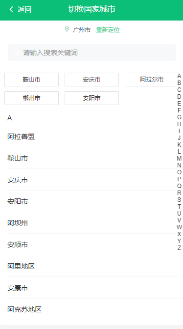

# 前言

初学vue的我们用一个星期来校验一下自己这半个月的成果 ♪(^∇^*)

## 项目名称

穷游网demo

## 技术栈

vue2.5+vuex+vue-router+webpack+ES6/7+axios+sass+Vant ui 

## 项目运行

### 注意：由于涉及大量的ES6/7等新属性，node需要6.0以上的版本

```
    git clone https://github.com/liangliangMirror/QYdemo.git

    cd qywdemo

    npm install或yarn

    npm run serve

```

## 关于接口数据

此项目的所有接口数据都来源于配套的后台系统，[后台项目传送地址。](http://www.baodu.com)

如果想体验前后台同时开发，可以下载后台系统。

## 链接

- [穷游网官网 (￣_,￣ )](https://www.qyer.com/)

- [我们的demo (๑•̀ㅂ•́)و✧](http://www.baodu.com)

## 部分截图

### 主页

 
 


### 自动定位




## 项目目标

- [x] 定位功能 -- 完成
- [x] 选择城市 -- 完成
- [x] 搜索地址 -- 完成
- [x] 主页瀑布流 -- 完成
- [x] 登录、注册 -- 完成
- [x] 城市详情页 -- 完成
- [x] 产品详情页 -- 完成
- [ ] 个人中心 --  1/2
- [ ] 修改密码 -- 未完成


## 项目布局

```


```

## 贡献者们/最棒的我们
  
<table><tbody><tr>
<td>
   <a href="https://github.com/liangliangMirror" title="liangliangMirror">  </a></td>
   <td><a href="https://github.com/tree-file" title="tree-file"> </a></td>
  <td> <a href="https://github.com/MaxinFN/" title="MaxinFN">  </a></td>
<tr></tbody></table> 